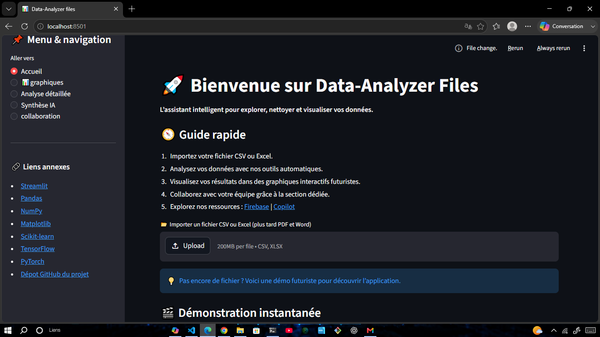
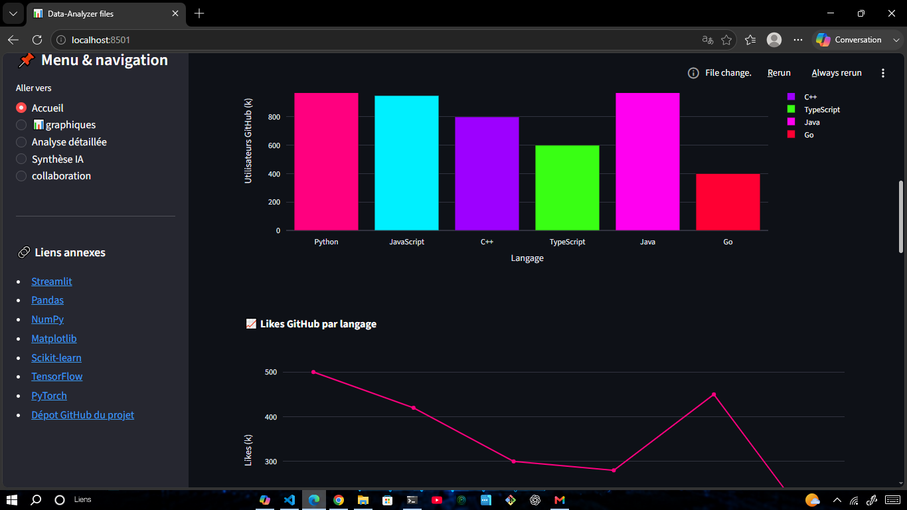

# 📊 DataAnalyzer Files

**DataAnalyzer Files** est une application Python conçue pour l'analyse, l'exploration et la visualisation de données à partir de différents formats de fichiers.

L'objectif du projet est de fournir une solution simple et évolutive permettant aux utilisateurs de comprendre rapidement leurs données grâce à une interface intuitive et des outils d'analyse automatisés.

---

## 🚀 Aperçu

### 🏠 Accueil



### 📈 Analyse & Visualisation



### 🤖 Synthèse IA


---

## ✨ Fonctionnalités

- Importation de fichiers CSV et Excel
- Analyse rapide des données
- Exploration détaillée des jeux de données
- Visualisations interactives
- Interface moderne développée avec Streamlit
- Architecture modulaire facilitant l'ajout de nouvelles fonctionnalités

---

## 🛠️ Technologies

- Python
- Pandas
- NumPy
- Matplotlib
- Streamlit

---

## 🤝 Équipe

### Ruphin

- Backend
- Lecture et traitement des fichiers
- Analyse des données
- Architecture du projet

### Gloire

- Interface utilisateur
- Expérience utilisateur (UX)
- Développement Streamlit

---

## 🔄 Développement en cours

Nous travaillons actuellement sur :

- [ ] Support des fichiers PDF
- [ ] Support des fichiers DOCX
- [ ] Génération de rapports avancés
- [ ] Optimisation des performances

### 🤖 Intelligence Artificielle

Une architecture basée sur les **LLMs** est actuellement en préparation.

Dans les prochaines semaines, le projet intégrera une **API d'intelligence artificielle** afin de proposer des fonctionnalités de synthèse et d'analyse assistée directement depuis l'application.

---

## ⚙️ Installation

```bash
git clone https://github.com/votre-utilisateur/DataAnalyzer-Files.git

cd DataAnalyzer-Files

pip install -r requirements.txt

streamlit run app.py
```

---

## 🤲 Contribuer

Les contributions, suggestions et retours sont toujours les bienvenus.

Que vous souhaitiez corriger un bug, améliorer l'interface, optimiser le backend ou proposer de nouvelles fonctionnalités, votre aide serait un véritable honneur pour nous.

N'hésitez pas à :

- ⭐ Ajouter une étoile au projet
- 🍴 Créer un fork
- 🛠️ Ouvrir une Pull Request
- 💡 Proposer des idées via les Issues

---

## 📬 Contact

**Email :** [geniruphin@gmail.com](mailto:geniruphin@gmail.com)

---

## ⭐ Soutenir le projet

Si DataAnalyzer Files vous semble utile ou intéressant, pensez à lui attribuer une étoile. Cela aide le projet à gagner en visibilité et motive son développement futur.
